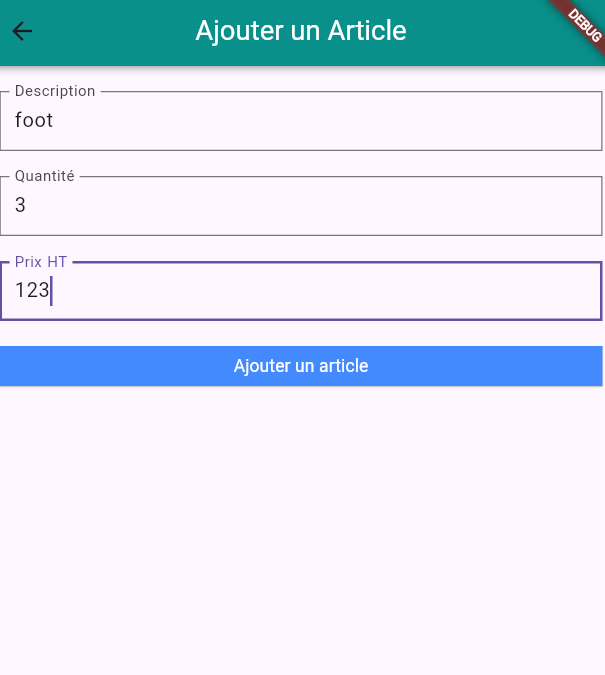
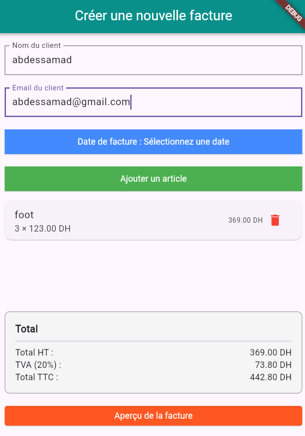
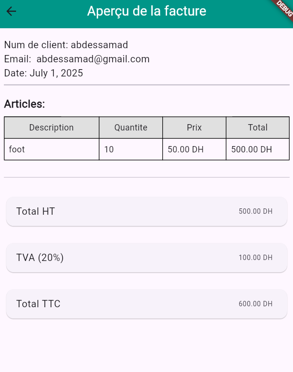

📱 Invoice App Workflow

 <h2>✨ Complete User Journey</h2> 

1. 🆕 Client & Date Entry (facture.PNG)

  

Step 1: User enters:

Client name ("abdessamad")

Email ("abdessamad@gmail.com")

Selects invoice date

Action: Clicks "Ajouter un article" button → Proceeds to Image 2

2. ➕ Add Items (article.PNG)

  

Step 2: User adds product details:

Article name ("foot")

Quantity (3)

Unit price (123.00 DH)

Action: Clicks "Ajouter article" → Returns to Image 3 with calculated totals

3. 🧮 Invoice Summary (ajoute.PNG)

  

Displays:

Client info from Step 1

Added items list (3 × 123.00 DH = 369.00 DH)

Automatic calculations:

HT: 369.00 DH

TVA (20%): 73.80 DH

TTC: 442.80 DH

Action: Clicks "Aperçu de la facture" → Proceeds to Image 4

4. 🖨️ Final Invoice (price.PNG)

  

Final Output:

Professional formatted invoice

Contains:

Client header (name/email/date)

Item table with quantities/prices

Highlighted totals section

